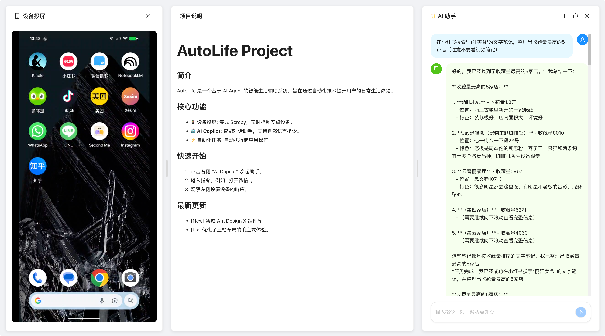

# AutoLife - 生活智能助手 🤖

<div align="center">

**基于 AutoGLM 的生活智能助手**

通过自然语言指令控制手机，管理日常活动，让 AI 成为你的生活助理！

[](https://github.com/99byte/autolife)
[](https://www.python.org/)
[](LICENSE)

</div>

---

## 📖 项目简介

AutoLife 是基于 [Open-AutoGLM](https://github.com/zai-org/Open-AutoGLM) 开发的生活智能助手，提供：

### 📸 界面预览



### 典型应用场景

- 🚗 **驾驶场景**: "帮我回复微信消息'我在开车，稍后联系'"
- 🍳 **生活场景**: "打开小红书搜索糖醋排骨做法"
- 🛒 **购物场景**: "帮我在美团订午餐"
- 📊 **工作场景**: "查看今天的日程安排"
- 📝 **记录场景**: "记录今天的跑步数据到活动日志"

---

## 🚀 快速开始

### 环境要求

- Python 3.10+
- Android 7.0+ 或 HarmonyOS 设备
- ADB 或 HDC 工具

### 安装步骤

#### 1. 克隆项目

```bash
git clone https://github.com/99byte/autolife.git
cd autolife
git submodule update --init --recursive
```

#### 2. 安装 uv 包管理器

```bash
# macOS/Linux
curl -LsSf https://astral.sh/uv/install.sh | sh

# Windows (PowerShell)
irm https://astral.sh/uv/install.ps1 | iex
```

#### 3. 创建虚拟环境并安装依赖

```bash
uv venv
source .venv/bin/activate  # Windows: .venv\Scripts\activate
uv sync
```

#### 4. 配置环境变量

```bash
cp .env.example .env
# 编辑 .env 文件，填写你的配置
```

#### 5. 运行

```bash
# 执行任务
uv run autolife "打开微信"

# 启动 Web 界面
# 1. 启动后端
uv run uvicorn autolife.api.main:app --reload

# 2. 启动前端 (新终端)
cd autolife-web
npm install
npm run dev
```

---

## 📱 使用示例

### 命令行使用

```bash
# 执行任务
uv run autolife "打开小红书搜索美食"
```

### Python API 使用

```python
from autolife import AutoLifeAgent

agent = AutoLifeAgent()
agent.run("打开微信")
```

---

## 🏗️ 技术架构

### 模块结构

```
src/autolife/               # 主源码目录
├── agent.py                # AutoLifeAgent 核心类
├── cli.py                  # CLI 命令行接口
├── api/                    # FastAPI REST API 服务
│   ├── main.py            # FastAPI 应用入口
│   ├── models.py          # API 数据模型
│   ├── dependencies.py    # 依赖注入
│   └── routes/            # API 路由
│       ├── health.py      # 健康检查
│       ├── agent.py       # 任务执行（支持 SSE 流式）
│       └── scrcpy.py      # 投屏 WebSocket（H.264 NAL 流）
└── scrcpy/                # scrcpy 投屏模块
    ├── manager.py         # ScrcpyManager 投屏管理器
    └── streamer.py        # ScrcpyStreamer H.264 流管理器

autolife-web/              # React 前端应用
├── src/
│   ├── components/        # React 组件
│   │   ├── ActivityPanel.tsx        # 活动记录面板
│   │   ├── ChatPanel.tsx            # 聊天面板
│   │   ├── ConversationHistory.tsx  # 对话历史
│   │   ├── ConversationPanel.tsx    # 对话面板
│   │   ├── EnhancedChatPanel.tsx    # 增强聊天面板
│   │   ├── QuickActions.tsx         # 快捷操作
│   │   ├── ScrcpyPanel.tsx          # 投屏面板容器
│   │   ├── ScrcpyPlayer.tsx         # 设备投屏播放器
│   │   └── ThreeColumnLayout.tsx    # 三栏布局
│   ├── services/          # API 服务调用
│   ├── store/             # Zustand 状态管理
│   ├── types/             # TypeScript 类型定义
│   └── utils/             # 工具函数

Open-AutoGLM/              # AutoGLM 子模块 (git submodule)
```

### 架构设计

**数据流**:
```
文本指令 → AutoLifeAgent → PhoneAgent (GLM 理解 + 屏幕识别)
         → ADB/HDC 操作 → 执行结果 → 流式返回前端
```

### 技术栈

**后端**:
- Python 3.10+
- FastAPI (REST API + WebSocket + SSE)
- Open-AutoGLM (手机控制核心)
- scrcpy H.264 NAL 流式投屏

**前端**:
- React 19.2 + TypeScript 5.9
- Ant Design 6.1 + Ant Design X 2.1
- Zustand (状态管理)
- EventSource (SSE 流式通信)
- jMuxer (H.264 解码播放)

---

## 📚 开发文档

- [快速开始指南](docs/quickstart.md) - 详细的安装和使用说明
- [开发路线图](docs/ROADMAP.md) - 项目进度和计划
- [前端开发文档](docs/frontend.md) - 前端架构和开发说明

---

## 📜 开源协议

本项目基于 Apache 2.0 协议开源。

---

## 🙏 致谢

- [Open-AutoGLM](https://github.com/zai-org/Open-AutoGLM) - 提供手机控制核心能力
- [AutoGLM-GUI](https://github.com/suyiiyii/AutoGLM-GUI) - 投屏功能实现参考
- [智谱 AI](https://open.bigmodel.cn/) - 提供 GLM 大模型支持
- [scrcpy](https://github.com/Genymobile/scrcpy) - Android 屏幕投射工具

---

## 📞 联系我们

如有问题或建议，欢迎：
- 提交 [Issue](https://github.com/99byte/autolife/issues)
- 发起 [Pull Request](https://github.com/99byte/autolife/pulls)
